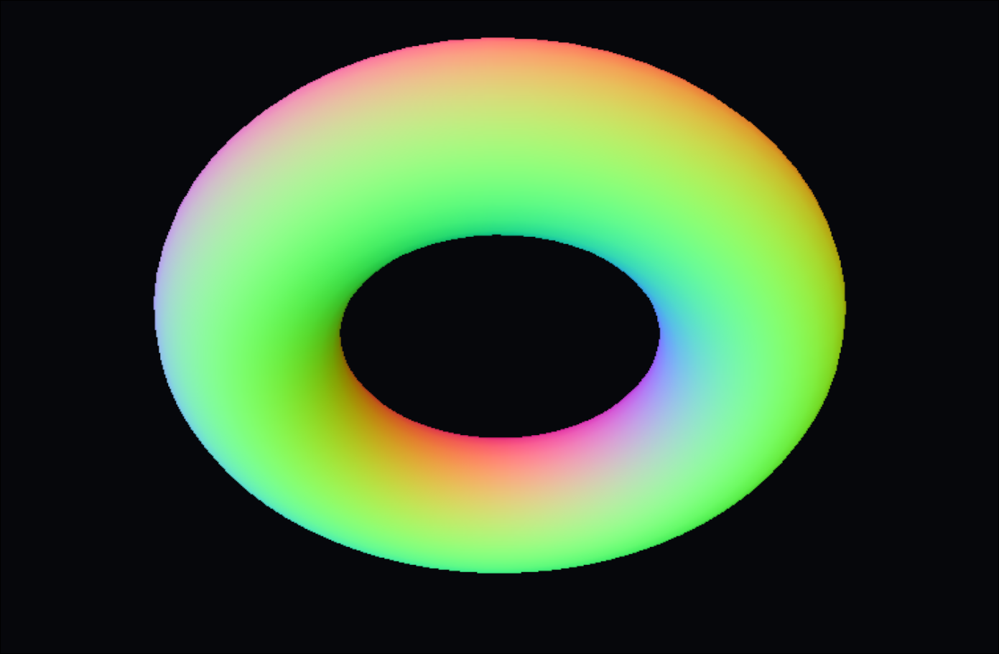

# k3d



Real-time 3D models, directly in your terminal.

`k3d` is a Linux-native CPU 3D viewer that presents an RGBA framebuffer via the Kitty Graphics Protocol. It ships with procedural demos and loaders for **OBJ**, **STL**, and **glTF / GLB** meshes.

## Requirements

Linux and [kitty](https://sw.kovidgoyal.net/kitty/) (or another terminal that supports the Kitty Graphics Protocol). Incompatible terminals receive a clear diagnostic and are never left in raw mode.

## Quick start

```sh
cargo run --release -- --demo torus --spin
cargo run --release -- model.obj
cargo run --release -- model.glb --theme catppuccin --fps 30
cargo run --release -- --demo sphere --screenshot sphere.png
cargo run --release -- --demo torus --benchmark
```

## Controls

| Input | Action |
|---|---|
| Left drag | Rotate |
| Right drag | Pan |
| Scroll wheel | Zoom |
| Arrows / `h` `j` `k` `l` | Rotate |
| `+` / `-` | Zoom in / out |
| `r` | Reset camera |
| `a` | Toggle auto-spin |
| Space | Pause / resume |
| `1`–`6` | Smooth, flat, wireframe, normals, depth, unlit |
| `f` | Toggle statistics overlay |
| `b` | Cycle backgrounds |
| `?` | Toggle help overlay |
| `q` / Esc / Ctrl-C | Quit |

## Options

| Flag | Description |
|---|---|
| `--demo cube\|sphere\|torus\|cylinder\|cone\|icosphere` | Run a built-in procedural demo |
| `--mode <MODE>` | Render mode (`smooth`, `flat`, `wireframe`, `normals`, `depth`, `unlit`) |
| `--theme <THEME>` | Color theme (`default`, `monochrome`, `catppuccin`, `gruvbox`, `tokyo-night`, `nord`) |
| `--background <BG>` | Background style (`solid`, `gradient`, `terminal`, `transparent`) |
| `--scale <FLOAT>` | Resolution multiplier (0.1–2.0, default 0.45) |
| `--fps <N>` | Target frame rate (1–240, default 60) |
| `--spin` | Start with auto-rotation enabled |
| `--no-animation` | Disable all animation |
| `--wireframe` | Shorthand for `--mode wireframe` |
| `--screenshot <PATH>` | Render a single frame to a PNG file (no terminal required) |
| `--benchmark` | Run a deterministic 120-frame CPU benchmark |

Run `k3d --help` for the full, authoritative option list.

## Architecture

Importers produce a unified `Asset` / `Mesh` representation. The renderer transforms, back-face culls, rasterizes with edge functions, depth-tests, and shades (Blinn-Phong) into a reusable RGBA framebuffer. Presentation is isolated behind `kitty.rs`, with double-buffered frame output to eliminate flicker, leaving room for PNG, Sixel, or another backend later.

## Development

```sh
cargo fmt --check
cargo clippy --all-targets --all-features -- -D warnings
cargo test
cargo build --release
```

## License

MIT
